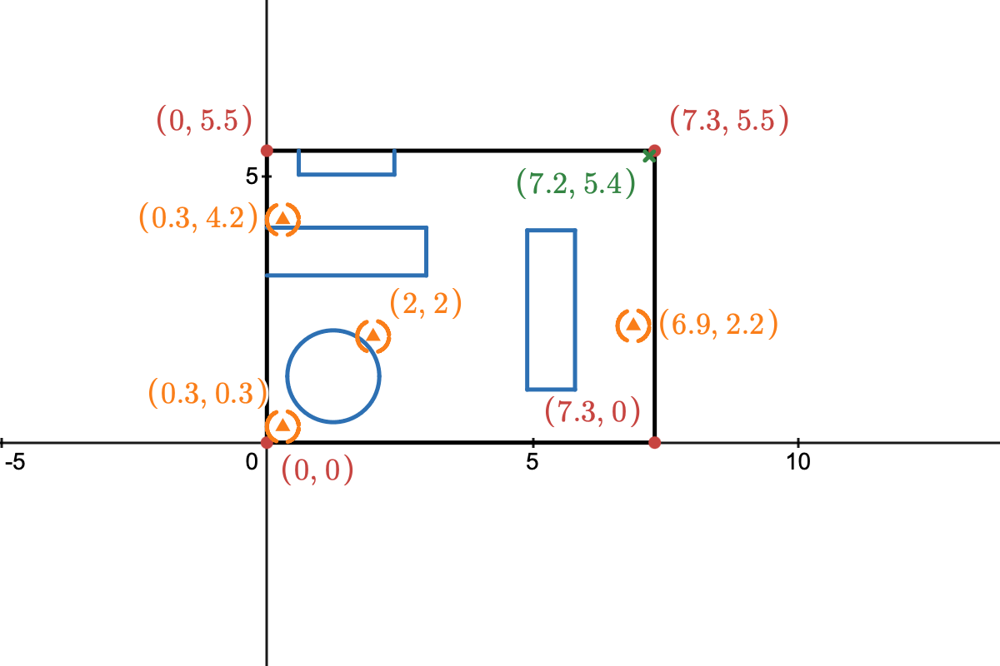

# Time distribution of finding a wallet in a room

## Problem description
We set a situation that a person need to find something, like keys, or wallet, in their house, we already know the position of the target object, let the person walk randomly in the house to find it.

## Question formulation
*What question(s) would you like to answer about your setup above?*
- what the distribution of the finding time? (under 2 different searching strategy)
    - mean: how long will the person find the item on average.
    - variance: how the finding time spread on its distribution.
    - etc.

## Mathematical model
*Identify variables, parameters, equations. List your assumptions.*

### Assumptions
- The person have a constant speed
- If the person reach the furniture or the wall of the house, he will reflects off and walk in a random direction.
    - do not go over above or under the furniture
- The position of the item is fixed, will not change over time or due to other reason.
- The person will not stop search until finding the item.
- The person cannot be helped by other people or pet.
- The target item
- Consider the house as a two dimensional plane.

### Constraints
- $t>0$.
- $X, Y \in \text{Room}$ 
- $\theta\sim \text{Unif}(0, 2\pi]$

### Variables & Parameters

|    Symbol     | Description                           |         Type         | Dimensions |
| :-----------: | :---: | :------------------: |    :---:   |
|      $X$      | The horizontal position of the person |  Dependent Variable  |      L     |
|      $Y$      | The vertical position of the person   |  Dependent Variable  |      L     |
|     $W_1$     | The horizontal component of Brownian motion | Random Variable|   T^-$\frac{1}{2}$    |
|     $W_2$     | The vertical component of Brownian motion | Random Variable|   T^-$\frac{1}{2}$    |
|     $v$  | The speed of the person walking in the house | parameter|    LT^-1  |
|     $\sigma$  | The parameter describing how fast the person diffuse by walking with Brownian motion in the house| parameter | LT^-$\frac{1}{2}$|
| $\theta$ | The angle we move while reach the boundary. | Random variable | - |
| $t$ | Time | Independent variable | T |
| $\Omega$ | Walkable space | Set | - |

### Equations

**Walkable space:**
- For $\Omega$, we have $\Omega = R_{room} \backslash (R_1 \cup R_2 \cup R_3 \cup C_1)$ for
    - $R_1 = \{(x,y) \in \mathbb{R}^2\mid 0.6 \le x \le 2.4 \ , 5.05 \le y \le 5.5 \}$
    - $R_2 = \{(x,y) \in \mathbb{R}^2\mid 0 \le x \le 3 \ , 3.15 \le y \le 4.05 \}$
    - $R_3 = \{(x,y) \in \mathbb{R}^2\mid 4.9 \le x \le 5.8 \ , 1 \le y \le 4 \}$
    - $C_1 = \{(x,y) \in \mathbb{R}^2\mid (x - 1.25)^2 + (y-1.25)^2 \le 0.75^2 \}$
    - $R_{room} =\{(x,y) \in \mathbb{R}^2\mid 0 \le x \le 7.3 \ , 0 \le y \le 5.5\}$  

**Strategy 1:** (Completely Random)

$$
dX = \sigma dW_1, \quad  dY = \sigma dW_2
$$

The **Wiener process** (or **Brownian motion**) is a continous stochastic process $W(t)$ such that:

1. $W(0) = 0$
2. $W(t + \Delta t) - W(t) \sim \mathcal{N}(0,\Delta t)$ for all $\Delta t$
3. $W(t_2) - W(t_1)$ and $W(t_1) - W(t_0)$ are independent for all $0 \leq t_0 < t_1 < t_2$
4. W is continuous

We approximate the Wiener process $W(t)$ with a discrete stochastic process:

1. Choose $T$ and $N$ for a discretization with timestep $\Delta t = T/N$.
2. Generate $N$ random samples of the standard normal distribution $\eta_k \sim \mathcal{N}(0,1)$ for $k=0,1,\dots,N-1$
3. Generate a random sample of the discretization $W = [W_k]$ using the recursive formula determined by the increment requirement above and $W_0 = 0$:

$$
W(t + \Delta t) - W(t) \sim \mathcal{N}(0,\Delta t)
\hspace{5mm} \rightsquigarrow \hspace{5mm}
W_{k+1} = W_k + \sqrt{\Delta t} \, \eta_k \ , \ \ k=0,1,\dots,N-1
$$

**Strategy 2:** (Robot Vacuum)

$$
dX = v*\cos(\theta)dt \quad dY = v*\sin(\theta)dt
$$

- If $(X_{n+1}, Y_{n+1})\in\Omega$ keep original $\theta$, it will be fine; if $(X_{n+1}, Y_{n+1})\not\in\Omega$, $\theta\sim \text{Unif}(0, 2\pi]$, and let $dX=X_{n+1} - X_n=0$ and $dY=Y_{n+1} - Y_n=0$

## How will you answer your question?
*Explain your approach to studying your model. Identify a mathematical quantity you will evaluate to answer your question.*

1. First non-dimensionlize the two equations.
2. Maybe. Check mean and variance.
3. Implement the code and see the distribution.

We wish to find the distribution and other statistical informations of the time spend to find the item with two strategies listed in the model section above.